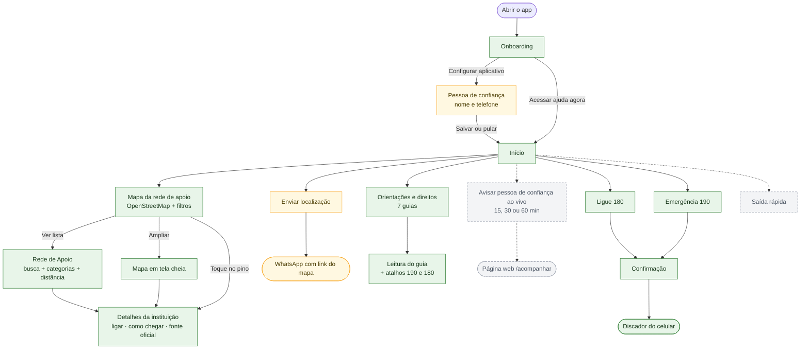
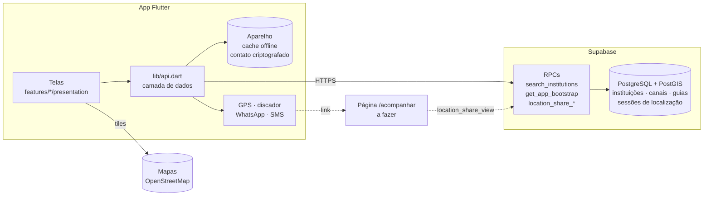

# Rede de Apoio

Projeto extensionista para facilitar o acesso de mulheres à rede de proteção, a contatos de confiança e a canais oficiais. A proposta é orientar e conectar: o produto **não substitui** polícia, Justiça, saúde, assistência social ou atendimento humano especializado.

Piloto: **Curitiba/PR**. Última atualização desta página: 25/09/2026.

## Estado atual

| Área | Situação |
| --- | --- |
| Backend (Supabase) | ✅ Pronto para o MVP: rede de apoio, canais de emergência, guias de direitos e localização ao vivo. Contrato em [docs/API.md](docs/API.md). |
| Camada de dados do app | ✅ Pronta em `app/lib/api.dart`. As telas só consomem. |
| Tela inicial | ✅ Mapa OpenStreetMap com pinos, filtros, localização sob demanda, botão 190, Ligue 180 e atalhos. |
| Rede de apoio | ✅ ~90 serviços de Curitiba com coordenadas oficiais (IPPUC): CRAS, CREAS, UPAs 24h, delegacias, Defensoria, Casa da Mulher Brasileira e hospitais de referência. Busca sem acento, filtros, raio de 20 km, selo de verificação, ligar e "como chegar". |
| Direitos e orientações | ✅ 7 guias com cache offline e aviso de revisão profissional pendente. |
| Pessoa de confiança | 🟡 Tela de cadastro existe, mas ainda não salva (o armazenamento criptografado já está pronto). |
| Enviar localização | 🟡 Envio da localização atual pelo WhatsApp funciona; ainda não usa o contato salvo. |
| Localização ao vivo | 🟡 Backend e controller prontos; faltam a tela e a página web `/acompanhar`. |
| Saída rápida | ⬜ A fazer. |
| Landing page React | ⬜ Planejada, ainda não inicializada. |
| Testes | ✅ 31 testes Flutter passando; testes do contrato da API em `backend/supabase/tests/api_test.sql`. |

Legenda: ✅ funcionando · 🟡 parcial · ⬜ a fazer.

## Fluxo do aplicativo (estado atual)



Verde: funcionando. Amarelo: parcial. Cinza tracejado: a fazer. A ajuda imediata (190, 180, rede de apoio e guias) funciona **sem login** e com conteúdo salvo para uso **sem internet**.

## Como as peças se conectam



Detalhes, decisões e sugestões de próximas funcionalidades: [docs/ARQUITETURA.md](docs/ARQUITETURA.md).

## Estrutura

```text
app-rede-apoio/
├── app/             # App Flutter (lib/api.dart = camada de dados; features/ = telas)
├── backend/         # Supabase: migrations, testes da API (legacy-node arquivado)
├── landing-page/    # Futura landing page React + página /acompanhar
├── docs/            # Arquitetura, API, escopo, ambiente e pendências
├── AGENTS.md        # Instruções para IAs e colaboradores
└── README.md        # Esta página
```

## Executar o aplicativo

Pré-requisitos: Flutter, Android Studio/SDK e um emulador ou celular Android. Guia completo: [docs/AMBIENTE-ANDROID.md](docs/AMBIENTE-ANDROID.md).

```powershell
cd C:\projetos\app-rede-apoio\app
flutter pub get
flutter analyze
flutter test
```

**No Android:** ligue o emulador, espere a tela inicial do Android aparecer e só então rode o app.

```powershell
%LOCALAPPDATA%\Android\Sdk\emulator\emulator.exe -avd medium_phone
# em outro terminal, depois que o Android abrir:
flutter devices
flutter run
```

**No navegador (teste rápido):** `flutter run -d chrome`. Mapa, lista e guias funcionam; GPS, discador e WhatsApp se comportam diferente do celular.

**Opções de build:**

| Variável | Uso |
| --- | --- |
| `--dart-define=TRACKING_PAGE_URL=https://.../acompanhar` | Liga a localização ao vivo (endereço da página `/acompanhar`). |
| `--dart-define=MAP_TILE_URL=https://.../{z}/{x}/{y}.png` | Troca o servidor de mapas (obrigatório antes de divulgar; ver ARQUITETURA.md). |

APKs e logs de execução (`run_log*.txt`) são locais e não vão para o Git.

## Backend

O backend é o Supabase, sem servidor próprio. Banco, API e testes ficam em `backend/supabase/`. Para aplicar e testar as migrations, veja [backend/supabase/README.md](backend/supabase/README.md).

## Tecnologias

- **Mobile:** Flutter e Dart. Pacotes principais: `supabase_flutter`, `flutter_map` + `latlong2` (mapa), `geolocator`, `url_launcher`, `flutter_secure_storage`, `shared_preferences`.
- **Backend:** Supabase (PostgreSQL + PostGIS, RPCs em SQL).
- **Mapas:** OpenStreetMap (atribuição obrigatória).
- **Landing page:** React e JavaScript (a iniciar).

## Segurança e limites do produto

- Localização só é obtida ou compartilhada com consentimento explícito, e o compartilhamento ao vivo tem prazo e botão de parar.
- A pessoa de confiança fica só no celular, criptografada; não há login nem conta.
- O servidor guarda só a última posição de um compartilhamento ativo e apaga ao encerrar.
- Endereços de Casa-Abrigo nunca são cadastrados nem exibidos.
- O app não aciona polícia, não registra BO e não promete invisibilidade no aparelho.
- Dados de instituições são curados a partir de fontes oficiais e mostram a data de verificação.

## Documentação

- [Guia para IAs e colaboradores](AGENTS.md)
- [Arquitetura e funcionalidades](docs/ARQUITETURA.md)
- [API para o front](docs/API.md)
- [Backend Supabase](backend/README.md)
- [Ambiente Android e testes](docs/AMBIENTE-ANDROID.md)
- [Escopo do projeto](docs/ESCOPO.md)
- [Contexto detalhado para IAs](docs/CONTEXTO-PARA-IAS.md)
- [Estrutura do repositório](docs/ESTRUTURA.md)
- [Pendências e prioridades](docs/PENDENCIAS.md)
