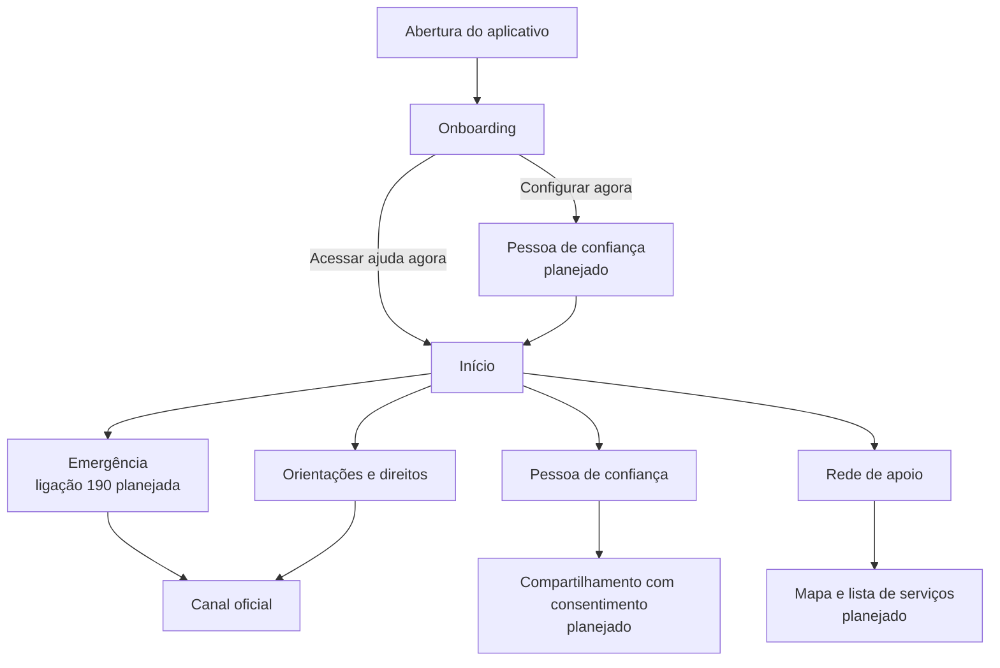

# Rede de Apoio

Projeto extensionista para facilitar o acesso de mulheres à rede de proteção, a contatos de confiança e a canais oficiais. A proposta é orientar e conectar: o produto **não substitui** polícia, Justiça, saúde, assistência social ou atendimento humano especializado.

## Estado atual

| Área | Situação |
| --- | --- |
| Backend (Supabase) | Pronto para o MVP: rede de apoio, canais de emergência, guias de direitos e localização ao vivo. Ver [docs/API.md](docs/API.md). |
| Camada de dados do app | Pronta em `app/lib/api.dart`: o front só consome. |
| Telas do app | Onboarding, Início e Rede de Apoio funcionais; demais telas a cargo do front. |
| Página /acompanhar | A criar (contrato em [docs/API.md](docs/API.md)). |
| Landing page React | Planejada, ainda não inicializada. |
| Integrações | Discador, WhatsApp/SMS e GPS com confirmação da usuária. Nenhuma integração com polícia, BO ou órgãos públicos. |

Piloto: **Curitiba/PR**. Arquitetura e funcionalidades: [docs/ARQUITETURA.md](docs/ARQUITETURA.md).

## Estrutura

```text
app-rede-apoio/
├── app/             # Aplicativo Flutter/Dart (lib/api.dart = camada de dados)
├── landing-page/    # Futura landing page React/JavaScript + página /acompanhar
├── backend/         # Supabase: migrations, testes da API (legacy-node arquivado)
├── docs/            # Escopo, contexto e pendências
├── AGENTS.md        # Instruções para IAs e colaboradores
└── README.md        # Visão geral do projeto
```

## Executar o aplicativo Android

Pré-requisitos: Flutter, Android Studio/SDK e o emulador `medium_phone` configurados.

```powershell
cd C:\projetos\app-rede-apoio\app
flutter pub get
flutter emulators --launch medium_phone
flutter run -d emulator-5554
```

Comandos úteis:

```powershell
flutter devices
flutter analyze
flutter test
flutter build apk --debug
```

O APK gerado é somente um artefato local de desenvolvimento e não deve ser enviado ao Git.

Para instalar ou recuperar todo o ambiente de testes Android, consulte o [guia completo de Android Studio e emulador](docs/AMBIENTE-ANDROID.md).

## Fluxo inicial de interface



O acesso a ajuda imediata deve permanecer disponível sem login. Itens marcados como “planejado” não devem ser apresentados como funcionais até terem implementação, validação e testes de segurança.

## Tecnologias

- **Mobile:** Flutter e Dart.
- **Landing page:** React e JavaScript.
- **Backend:** Supabase (PostgreSQL + PostGIS, RPCs em SQL). Sem servidor próprio.

## Segurança e limites do produto

- Localização e alertas só podem existir com consentimento explícito, revogável e informado.
- Não prometer acionamento automático de polícia, emergência ou boletim de ocorrência.
- Integrações com governos e canais oficiais exigem parceria e validação jurídica/técnica.
- Não coletar ou manter dados sensíveis sem necessidade clara, proteção adequada e política de retenção.

## Documentação para continuar o projeto

- [Guia para IAs e colaboradores](AGENTS.md)
- [Arquitetura e funcionalidades](docs/ARQUITETURA.md)
- [API para o front](docs/API.md)
- [Backend Supabase](backend/README.md)
- [Ambiente Android e testes](docs/AMBIENTE-ANDROID.md)
- [Escopo do projeto](docs/ESCOPO.md)
- [Contexto detalhado para IAs](docs/CONTEXTO-PARA-IAS.md)
- [Estrutura do repositório](docs/ESTRUTURA.md)
- [Pendências e prioridades](docs/PENDENCIAS.md)
