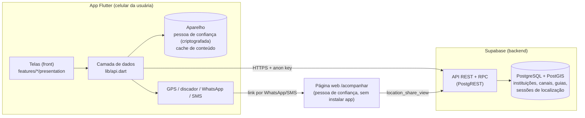
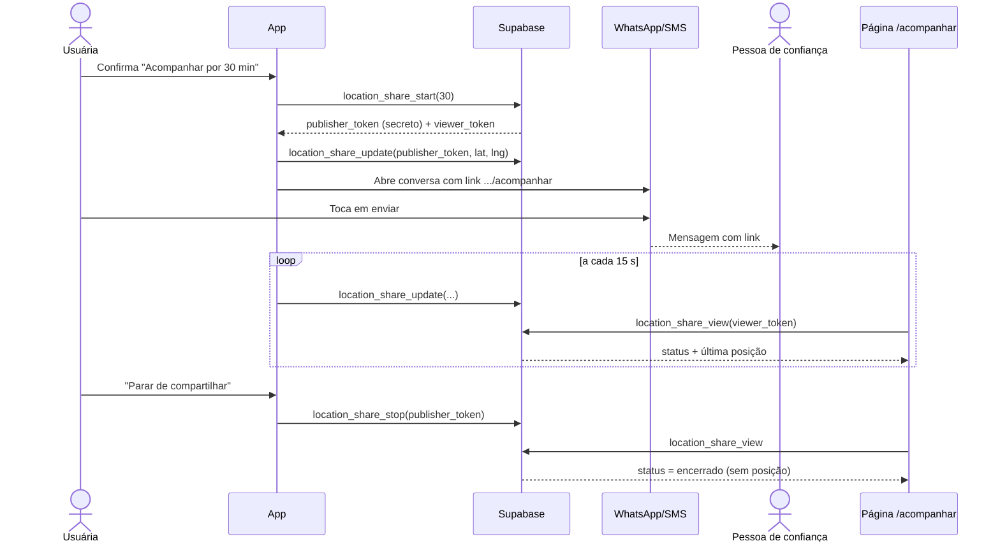

# Arquitetura — Rede de Apoio

Última atualização: 25/09/2026. Piloto: **Curitiba/PR**.

## 1. Visão geral



**Três peças:**

1. **Backend = Supabase.** Banco com PostGIS e funções RPC. Nenhum servidor próprio. Código em `backend/supabase/migrations/`.
2. **App Flutter.** Dividido em **camada de dados** (pronta, em `lib/api.dart`) e **telas** (responsabilidade de quem faz o front).
3. **Página de acompanhamento** (`/acompanhar`). Página web simples em que a pessoa de confiança vê a localização ao vivo sem instalar o app. Fica no projeto da landing page.

**Regra de ouro para o front:** as telas só usam o que está em `lib/api.dart`. Não chamam o Supabase diretamente, não escrevem SQL e não guardam dados sensíveis por conta própria. O contrato completo está em [API.md](API.md).

## 2. Decisões de arquitetura

| Decisão | Motivo |
| --- | --- |
| Só Supabase, sem servidor Node | Menos peças para hospedar e manter; a API Node nunca foi usada e tinha falha de segurança. |
| Base de instituições **curada** (sem busca automática no app) | Telefone ou endereço errado é risco à usuária; endereço de Casa-Abrigo é sigiloso. |
| Pessoa de confiança **só no aparelho** | Não guardar dado pessoal de terceiros no servidor (LGPD); dispensa login. |
| Sem login | Ajuda imediata não pode depender de cadastro (regra 1 do AGENTS.md). |
| Localização ao vivo com **dois tokens** | O link recebido pelo contato só permite ver; enviar e encerrar exige o token secreto que fica no app. |
| Só a **última posição** no servidor | Sem histórico de trajeto; apagada ao encerrar. |
| Conteúdo com **cache offline** | Canais e guias precisam funcionar sem internet; o app já sai com uma versão embutida. |

## 3. Funcionalidades iniciais (MVP) e como funcionam

### 3.1 Rede de apoio próxima

1. A tela pede a posição (com permissão) via `LocationService`.
2. Chama `SupportNetworkService.buscarInstituicoes(texto, categorias, lat, lng)`, que chama a RPC `search_institutions`.
3. O PostGIS ordena por distância; a busca ignora acentos.
4. Sem internet: lista de contingência de Curitiba no próprio app, com as mesmas regras de busca.
5. Cada instituição traz selo de verificação, fonte oficial e se a coordenada é aproximada (nesse caso, "Como chegar" usa o endereço).

**Falta no front:** mapa com pinos (sugestão: `flutter_map` + OpenStreetMap, respeitando a política de uso de tiles, ou Google Maps SDK). Os dados (lat/lng) já vêm prontos.

### 3.2 Botão de emergência

1. Os telefones vêm de `AppContentRepository.carregar()` → `emergencyChannels` (190, 180 com WhatsApp, 192 e 153 de Curitiba), com cache offline.
2. O botão principal usa `conteudo.primaryEmergency` (190).
3. Confirmação obrigatória antes de discar (`EmergencyService.confirmarELigar190`) — a ligação só começa quando a usuária confirma no discador.
4. Se `EmergencyService.discar()` retornar `false`, a tela **deve** mostrar o número grande para discagem manual.

### 3.3 Pessoa de confiança (cadastro no início)

1. No onboarding, a usuária informa um apelido e um telefone (pode pular).
2. `TrustedContact.fromInput()` valida e normaliza o telefone.
3. `TrustedContactRepository.salvar()` guarda criptografado no aparelho.

### 3.4 Avisar a pessoa de confiança com a localização

Duas opções na tela, sempre com **confirmação** antes:

- **Localização atual (uma vez):** `ShareLocationService.enviarComFallback(telefone)` abre o WhatsApp/SMS com link do Google Maps. Funciona sem backend.
- **Acompanhar ao vivo (15, 30 ou 60 min):** `LocationShareController.iniciar(contato, minutos)`.



**Limitação atual:** a posição é enviada enquanto o app está aberto. Para enviar com a tela bloqueada é preciso um serviço em primeiro plano no Android (próxima etapa, com notificação neutra). A página `/acompanhar` também precisa ser criada e hospedada; enquanto `TRACKING_PAGE_URL` não for configurado, o app desativa o modo ao vivo e oferece só a localização atual.

### 3.5 Direitos e orientações

1. Os guias vêm em `AppContentRepository.carregar()` → `guides` (Markdown), com cache offline.
2. Guias atuais: emergência, plano de segurança, boletim de ocorrência, medida protetiva, Lei Maria da Penha, apoio financeiro, segurança digital.
3. `reviewedAt == null` significa **aguardando revisão por profissional** da rede. Todos os guias estão nesse estado. A tela deve deixar isso claro até a revisão.

## 4. O que mais podemos colocar (sugestões priorizadas)

### Prioridade alta — completar o MVP

| Funcionalidade | Por quê | Backend |
| --- | --- | --- |
| **Saída rápida** (botão que troca na hora para uma tela neutra ou fecha o app) | Proteção se o agressor se aproximar | Nenhum |
| **Aviso de limites do app** no primeiro uso | Deixar claro que não substitui 190/180 | Nenhum |
| **Mapa com pinos** da rede de apoio | Pedido principal do front | Pronto |
| **Plano de segurança interativo** (checklist salvo só no aparelho) | Ajuda prática para quem planeja sair | Nenhum (guia já existe) |
| **Página /acompanhar** | Necessária para o compartilhamento ao vivo | Pronto |

### Prioridade média — próxima versão

| Funcionalidade | Por quê | Backend |
| --- | --- | --- |
| **Modo discreto** (tema neutro, notificações sem palavras sensíveis) | Reduz exposição no celular | Nenhum |
| **Envio em segundo plano** da localização | Funcionar com a tela bloqueada | Pronto |
| **Mais de uma pessoa de confiança** (até 3) | Se a primeira não responder | Nenhum |
| **Importação de CRAS/CREAS** de Curitiba | Ampliar a rede | Migration nova + curadoria |
| **"Aberto agora"** no filtro | Evitar deslocamento em vão | Pronto (horários no banco) |
| **Reportar dado errado** numa instituição | Ajuda a manter a base correta | RPC nova que grava na `institution_review_queue` |
| **Painel de curadoria** para a equipe | Aprovar pendências sem SQL | Supabase Auth + telas admin |
| **Acessibilidade**: leitor de tela, fonte grande, alto contraste | Público diverso sob estresse | Nenhum |

### Avaliar com profissionais da rede antes de fazer

- **Violentômetro** (escala informativa de sinais de violência): só informativo, nunca "diagnóstico".
- **Palavra-código** combinada com a pessoa de confiança: mensagem pré-pronta que parece conversa comum.
- **Ícone e nome alternativos**: exige preparo nativo; não prometer invisibilidade.
- **Conteúdo em áudio e em outros idiomas** (espanhol, inglês).

### Não fazer (fora do escopo, ver ESCOPO.md)

- Guardar provas, relatos ou áudios no servidor.
- BO automático ou botão que "aciona a polícia".
- Rastreamento contínuo ou histórico de trajeto.
- IA para classificar risco ou decidir o que a usuária deve fazer.

## 5. Estrutura de pastas

```text
app-rede-apoio/
├── app/                                  # App Flutter
│   ├── assets/offline/                   # Conteúdo embutido para o 1º uso sem internet
│   ├── lib/
│   │   ├── api.dart                      # ← ÚNICO import que o front precisa
│   │   ├── main.dart
│   │   ├── app/                          # MaterialApp e rotas
│   │   ├── core/
│   │   │   ├── config/                   # AppConfig, SupabaseConfig
│   │   │   ├── content/                  # Canais, categorias, guias (bootstrap + cache)
│   │   │   ├── services/                 # GPS, discador, WhatsApp/SMS
│   │   │   ├── theme/                    # Cores e tema
│   │   │   ├── utils/                    # Normalização de texto
│   │   │   └── widgets/                  # Componentes visuais reutilizáveis
│   │   └── features/
│   │       ├── support_network/          # Rede de apoio: data/ domain/ presentation/
│   │       ├── trusted_contact/          # Pessoa de confiança: data/ domain/ presentation/
│   │       ├── location_share/           # Localização ao vivo: data/ domain/ (presentation: front)
│   │       ├── guidance/                 # Direitos e orientações: presentation/ (front)
│   │       ├── home/                     # Tela inicial: presentation/
│   │       └── onboarding/               # Primeiro uso: presentation/
│   └── test/
├── backend/
│   ├── supabase/
│   │   ├── migrations/                   # Todo o banco e a API
│   │   ├── tests/api_test.sql            # Testes do contrato
│   │   └── config.toml
│   └── legacy-node/                      # API Node antiga (arquivada)
├── landing-page/                         # Landing page + página /acompanhar (a criar)
└── docs/
    ├── ARQUITETURA.md                    # Este documento
    ├── API.md                            # Contrato da API para o front
    ├── ESCOPO.md, PENDENCIAS.md, ...
```

**Convenção por funcionalidade:**

- `data/` — chamadas ao Supabase, armazenamento, controllers. **Pronto; o front só usa.**
- `domain/` — modelos (classes de dados).
- `presentation/` — telas e widgets. **Responsabilidade do front.**

## 6. Segurança e privacidade (resumo)

- A chave `anon` do Supabase é pública; a proteção é o RLS e as funções com permissões restritas.
- Tabelas sensíveis (`location_shares`, `institution_review_queue`) não podem ser lidas pelo app.
- Tokens de localização são guardados só como hash; o token secreto nunca sai do celular.
- Limite de 10 sessões de localização por hora por origem.
- Casa-Abrigo nunca aparece na API.
- A posição da usuária usada para ordenar a rede de apoio não é gravada.
